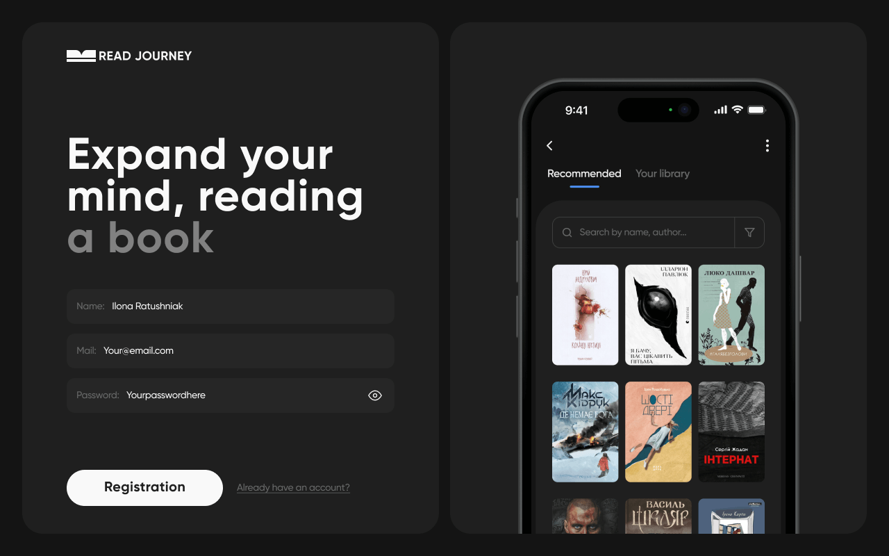
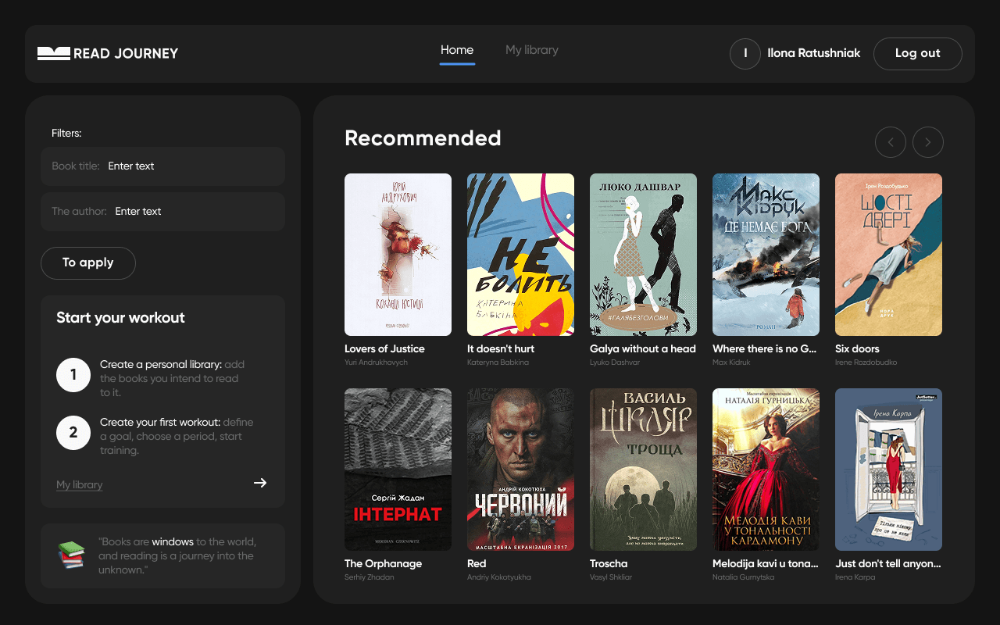
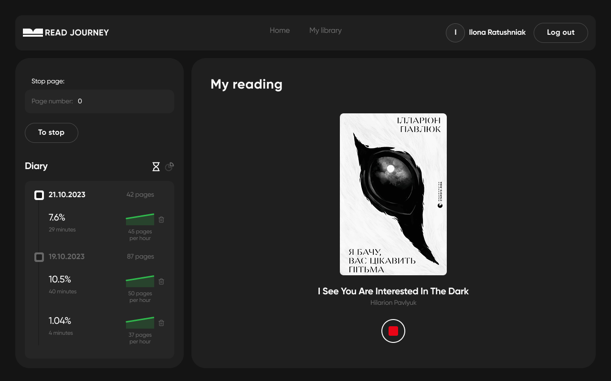

#  Read Journey App

This app is designed for book lovers who want to track their reading progress.
Easily manage your reading list, mark completed books, and stay motivated as you
reach your reading goals.

## 🖼️ Preview

**📊 Register Page**

**🏢 Recommended Page**

**🏢 Reading Page**

## 📚 Features

- **Adaptive Design:** 📱 The app features an adaptive layout optimized for
  desktops, tablets, and smartphones, including support for Retina and
  high-resolution displays to ensure crisp and clear visuals on all devices.

- **User Authentication:** 🔐 Secure user registration, login, logout, and
  current user session handling.
- **Recommendations Page (Private):** 🌟 Discover recommended books with:

  - 🔍 **Search** by title or author.
  - 📄 **Pagination** for easy navigation through the book list.
  - ➕ **Add to Library** feature to save recommended books to your personal
    collection.

- **Personal Library Page (Private):** 📖 Manage your own reading collection:

  - 📝 **Add Custom Books** not found in recommendations.
  - 🗂️ **Filter Books** by status: All / In Progress / Read / Unread.
  - 📘 **Start Reading** any book directly from your library.

- **Reading Tracker Page (Private):** ⏱️ Stay motivated and track your reading
  activity:
  - ✅ **Mark** start and end of reading sessions.
  - 📊 **Visual Progress Tracking** via a progress bar and circular chart.

## 🛠️ Technologies Used

- **React:** ⚛️ JavaScript library for building user interfaces.
- **Vite:** ⚡ Next-generation frontend tooling for fast development.
- **React Router:** 🗺️ Declarative routing for React.
- **React Redux:** 📦 Predictable state management for React applications.
- **Redux Persist:** 💾 Persist and rehydrate your Redux store.
- **Axios:** 🌐 Promise-based HTTP client for making API requests.
- **React Helmet:** 🧠 Manage changes to the document head, including title and
  meta tags.
- **React Hook Form:** 📝 Performant and flexible form validation for React.
- **Yup:** ✅ Schema builder for value parsing and validation.
- **React Modal:** 🖼️ Accessible modal dialog component for React.
- **clsx:** ✨ A tiny utility for constructing `className` strings
  conditionally.
- **react-hot-toast:** 🍞 Elegant and simple toast notifications for React.
- **react-spinners:** ⏳ A collection of loading indicators for React.
- **modern-normalize:** 🧼 Normalize browser defaults for consistent styling.
- **Vercel:** 🚀 Deployed and hosted on [Vercel](https://vercel.com/).

## 🔗 Project Resources

- **Live App:** 🌐
  [Read Journey](https://read-journey-one-sepia.vercel.app/login)
- **Backend API Docs:** 🛠️
  [https://readjourney.b.goit.study/api-docs/](https://readjourney.b.goit.study/api-docs/)
- **Figma Design:** 🎨
  [BOOKS READING – Figma](https://www.figma.com/file/z3m0rdBcEfLTJUBDkAKhWQ/BOOKS-READING?type=design&node-id=18743%3A4973&mode=design&t=Hi1KTaUJMogWXZzz-1)

## 📦 Setup Instructions

1. Clone the Repository: git clone https://github.com/your-repo/read-journey.git

2. Navigate to the project folder: `cd read-journey`

3. Install Dependencies: `npm install`

4. Run the development server: `npm run dev`

5. Open the app in your browser at http://localhost:3000

## 🖋️ Author

Mariia Ostapets, Fullstack developer

[LinkedIn](https://www.linkedin.com/in/mariia-ostapets/) |
[GitHub](https://github.com/Mariia-Ostapets)
